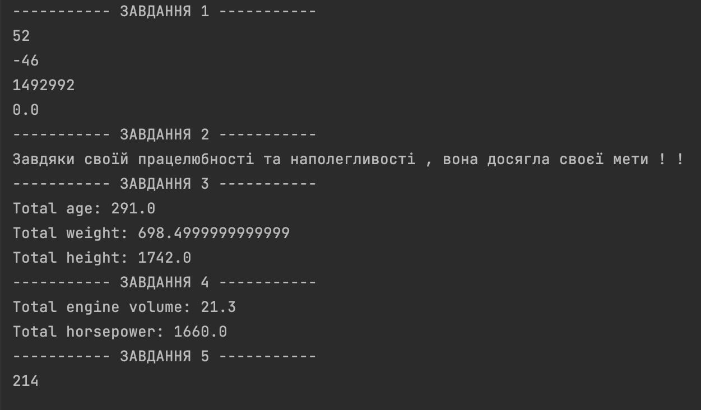

# Laboratory work 1

# Description

This project involves the following tasks:

1. Performing arithmetic operations on variables and printing the output data to the console.

2. Creating a sentence using variables and outputting the sentence to the console.

3. Creating a user class with the fields ID, age, first name, last name, weight and height and adding the age, weight, height fields to a group of 10 objects of the User class and outputting the result to the console.

4. Create a Car class with fields for Horsepower, Engine Power, Model, Year, Color, Fuel Type and Mileage and perform the addition of the Horsepower, Engine Power fields for a group of 10 objects of the Car class and output the result to the console.

5. Creating an inverted three-digit number.

# Requirements
To run this project, you must have the following installed on your computer:
Java Development Kit (JDK) version [insert version number here]

# Instructions for creation
Instructions for creation
Clone the repository to your local machine using
```
git clone https://github.com/OlenaChemerynska2003/Olena_Chemerynska_TR_22_2023.git
```

# Instructions for starting
To start the project: when we have already cloned the project, open the terminal and write the following commands
```
cd src
```
And we write the commands to launch the project
```
javac Main.java

java Main
```
# Results



# Support
If you have any problems during the project, please contact us at email Olena.Chemerynska.tr.2021@lpnu.ua
