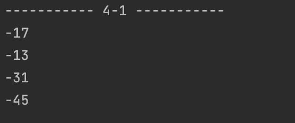
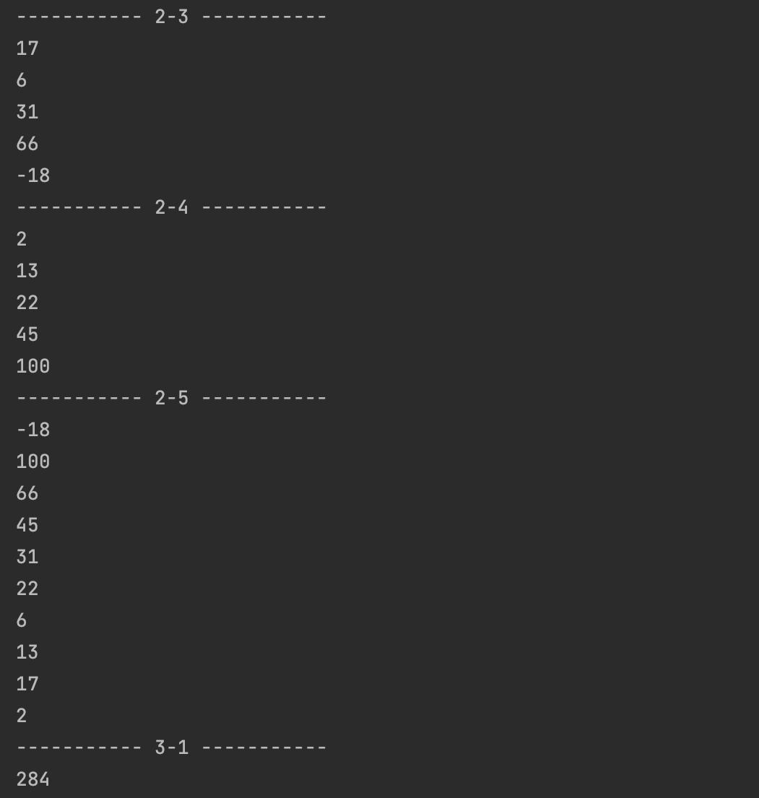
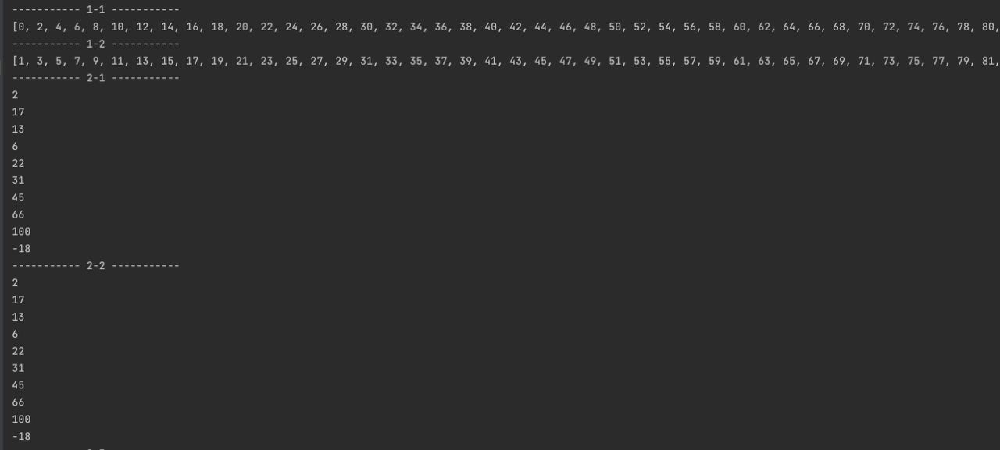

# Laboratory work 4

# Description

1. Creating an empty array and filling it with 50 even and 50 odd numbers.

2. Creating an array of 10 numbers [2,17,13,6,22,31,45,66,100,-18] and looping it through a while loop, looping it through a for loop, looping through a while loop and outputting numbers only with an odd index, looping with a for loop and output numbers only with an even index, output the array in the reverse order.

3. Calculation of the sum of array elements in a one-dimensional array consisting of n real elements.

4. Change the sign of all odd array elements.

# Requirements
To run this project, you must have the following installed on your computer:
Java Development Kit (JDK) version [insert version number here]

# Instructions for creation
Instructions for creation
Clone the repository to your local machine using
```
git clone https://github.com/OlenaChemerynska2003/Olena_Chemerynska_TR_22_2023.git
```

# Instructions for starting
To start the project: when we have already cloned the project, open the terminal and write the following commands
```
cd src
```
And we write the commands to launch the project
```
javac Main.java

java Main
```
# Results




# Support
If you have any problems during the project, please contact us at email Olena.Chemerynska.tr.2021@lpnu.ua
