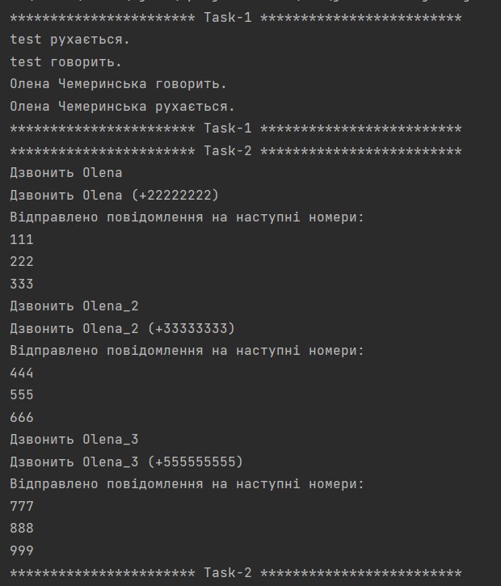
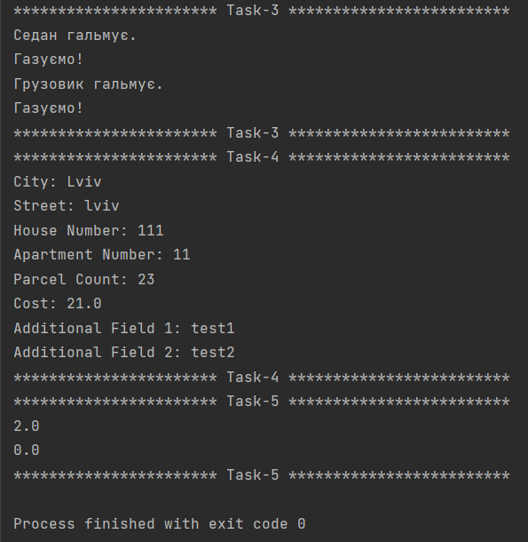

# Laboratory work 6

# Description

1. Creation of the Person class, which contains the fields fullName, age, the move() and talk() methods, in which it is easy to display the message -"Such and such a Person speaks" on the console, two constructors - Person() and Person(fullName, age ). Creating two objects of this class. One object is initialized by the Person() constructor, the other by Person(fullName, age).
2. Creation of the Phone class, which contains the number, model, and weight fields. Creating three instances of this class. Display the value of their variables on the console. Adding methods to the Phone class: receiveCall, has one parameter - the name of the caller. Display the message “{name} is calling” on the console. getNumber - returns the phone number. Call these methods for each of the objects. Adding a constructor to the Phone class, which accepts three parameters at the input for initializing the class fields - number, model and weight. Adding a constructor that accepts two parameters for initializing class fields - number, model. Adding a parameterless constructor. Adding an overloaded method receiveCall, which accepts two parameters - the name of the subscriber (the one who is calling) and the phone number. Calling this method. Creating a sendMessage method with variable-length arguments. This method accepts as input phone numbers to which the message will be sent. The method outputs the numbers of these phones to the console.
3. Implementation of a hierarchy with five classes, namely: shape, SolidOfRevolution, cylinder, ball and pyramid.
4. Creation of an abstract Car class with fields model, color and maximum speed. The class also contains methods: "regular" gas(), which simply displays some text on the screen (n-d, "We're gassing!") and an abstract method for braking void brake(). Implementation of derivative classes Sedan and Truck. Creation of Sedan and Truck class objects. Method execution on behalf of created objects.
5. Creating a class that describes mail sorting. Class data: city, street, house, apartment, number of parcels, cost. Open functions of the class: data input, data output, calculation of the total number of parcels and the total cost.

# Requirements
To run this project, you must have the following installed on your computer:
Java Development Kit (JDK) version [insert version number here]

# Instructions for creation
Instructions for creation
Clone the repository to your local machine using
```
git clone https://github.com/OlenaChemerynska2003/Olena_Chemerynska_TR_22_2023.git
```

# Instructions for starting
To start the project: when we have already cloned the project, open the terminal and write the following commands
```
cd src
```
And we write the commands to launch the project
```
javac Main.java

java Main
```
# Results




# Support
If you have any problems during the project, please contact us at email Olena.Chemerynska.tr.2021@lpnu.ua
