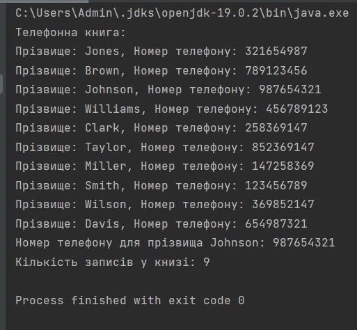

# Laboratory work 7

# Description

1. Creating a car class with fields: Car brand, engine power, driver, price, year of manufacture.
      Creating a driver class with fields: name, age, driving experience. Classes must have all the necessary set of methods, including constructors.
      We create at least 10 and no more than 20 machines. When creating objects, we use constructors with parameters. We put all our created cars in an ArrayList.
      We are doing engine repair for half of the fleet, which will increase the power of the cars by 10% (reassignment of the power field). We are hiring new drivers for repaired cars (reassign the driver field).
      Next, we take every second car (using a loop with a step of 2 and the size() method), and give it a 10% increase in engine power and a 5% price increase.
      After that, we check the experience of all drivers. If the driver's experience is less than 5 years, but his age is more than 25, then we send him to advanced training courses, which will increase his experience by 1 year.
      We create a helper class, where we write a method that accepts an array of cars as a parameter and selects a random element from this array ( new Random().nextInt(cars.length); cars is the name of the array of cars (substitute your own)).
      We display the text in the console in the style of "Car *model* with driver *name* left for you." Next, we pass this car to the next method, which will output to the console "Driver *name* has arrived at the location."
2. We write a "Phonebook" program that stores surnames and phone numbers using the HashMap class.
     We use the following Map operations: put (K key, V value) - adds an element to the map; get (Object key) - searches for a value by its key; remove (Object key) - removes the value by its key; containsKey (Object key) - asks if the given key is in the map; containsValue (Object value) - asks if there is a specified value in the map; size () - returns the size of the map (the number of "key-value" pairs).
   Add at least 10 names and phone numbers to the book.
   Using a loop, we extract information from the book.
   We find the given number in the book by last name. If the last name is missing, the message "There is no such subscriber in the book" will be displayed on the screen. We delete an arbitrary entry from the book. We display the number of entries in the book.# Requirements
To run this project, you must have the following installed on your computer:
Java Development Kit (JDK) version [insert version number here]

# Instructions for creation
Instructions for creation
Clone the repository to your local machine using
```
git clone https://github.com/OlenaChemerynska2003/Olena_Chemerynska_TR_22_2023.git
```

# Instructions for starting
To start the project: when we have already cloned the project, open the terminal and write the following commands
```
cd src
```
And we write the commands to launch the project
```
javac Main.java

java Main
```
# Results



# Support
If you have any problems during the project, please contact us at email Olena.Chemerynska.tr.2021@lpnu.ua
