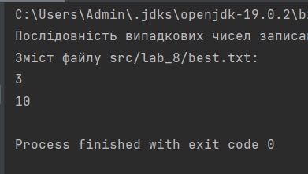

# Laboratory work 8

# Description

1. We create the FileWriter and FileReader classes. We implement a program that writes a sequence of random numbers in the range specified using the command line parameters to a file (txt type). We also specify the file name in the command line. The program provides a check for the existence of a file with a given name.
   To generate a random number within [b1,b2], we use the formula new Random().nextInt(b2-b1+1)+b1.
2. We read information from the file created in the previous task. We display it on the console.

# Instructions for creation
Instructions for creation
Clone the repository to your local machine using
```
git clone https://github.com/OlenaChemerynska2003/Olena_Chemerynska_TR_22_2023.git
```

# Instructions for starting
To start the project: when we have already cloned the project, open the terminal and write the following commands
```
cd src
```
And we write the commands to launch the project
```
javac Main.java

java Main
```
# Results



# Support
If you have any problems during the project, please contact us at email Olena.Chemerynska.tr.2021@lpnu.ua
